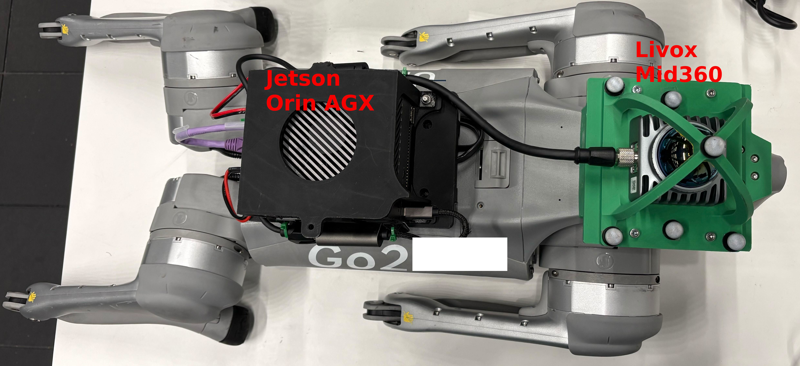

# Deployment Instructions

## Hardware Setup



We mount a [Jetson Orin AGX 64GB](https://www.nvidia.com/en-us/autonomous-machines/embedded-systems/jetson-orin/) on the [Unitree Go2](https://www.unitree.com/cn/go2) robot.
A [Livox Mid360](https://www.livoxtech.com/mid-360) LiDAR is used for perception, which is connected to the Jetson Orin.

## Building and Deployment

Our testing environment is Ubuntu 22.04 with ROS2 Humble.

Inside `reasan` folder contains the C++ project for building deployment nodes.
Inside `resple` folder contains the modified version of [RESPLE](https://asig-x.github.io/resple_web/), a LiDAR Inertial Odometry (LIO) system.

Before building and testing, copy the deployment folder to Jetson Orin.

### Building REASAN Deployment Nodes

We use Jetpack 6.2.1 for the Jetson Orin, which is based on Ubutnu 22.04.
Also install CUDA, CuDNN, TensorRT when flashing with Jetson SDK Manager.
You can follow this [guide](https://developer.nvidia.com/embedded/learn/jetson-agx-orin-devkit-user-guide/two_ways_to_set_up_software.html#1-how-to-use-sdk-manager-to-flash-l4t-bsp).
After successful installation, you can validate with these commands:
```
nvcc --version # verify nvcc
ls -l /usr/local/cuda # verify cuda
ls -l /usr/lib/aarch64-linux-gnu/libcudnn* # verify cudnn
ls -l /usr/lib/aarch64-linux-gnu/libnvinfer* # verify tensorrt
```

Install ROS2 Humble, following [this](https://docs.ros.org/en/humble/Installation/Ubuntu-Install-Debs.html).

Install some packages:
```
sudo apt install -y libfmt-dev libeigen3-dev cmake build-essential
```

Install Unitree SDK2, as instructed [here](https://github.com/unitreerobotics/unitree_sdk2).

Install [unitree_sdk2_python](https://github.com/unitreerobotics/unitree_sdk2_python).
Install from source, build cyclonedds as instructed in the FAQ 1, and use these commands to install the unitree_sdk2_python package:
```
#use the following commands instead of those given in repository
cd ~/unitree_sdk2_python
export CYCLONEDDS_HOME=/home/{YOUR_USERNAME}/cyclonedds/install
# if this doesn't work, try this one
export CYCLONEDDS_HOME=$HOME/cyclonedds/install
pip3 install -e . --no-build-isolation
```

Install [livox_ros2_driver](https://github.com/Livox-SDK/livox_ros_driver2).

#### Install ONNX Runtime

Now we need to install [onnxruntime](https://github.com/microsoft/onnxruntime).
We adapt the build instructions [here](https://onnxruntime.ai/docs/build/eps.html#nvidia-jetson-tx1tx2nanoxavierorin).

First, download onnxruntime [v1.23.2](https://github.com/microsoft/onnxruntime/releases/tag/v1.23.2) aource code and extract to `~/onnxruntime`.

Then install dependencies:
```
sudo apt install -y --no-install-recommends \
  software-properties-common libopenblas-dev \
  libpython3.10-dev python3-pip python3-dev python3-setuptools python3-wheel
```

Afterwards, install cmake 3.28.5.
You can download the install script [here](https://cmake.org/files/v3.28/).
```
chmod +x ./cmake-3.28.5-linux-aarch64.sh
sudo ./cmake-3.28.5-linux-aarch64.sh --prefix=/usr/local
# check cmake version; should be 3.28 now
cmake --version
# if you encounter errors or version not update, reboot may solve the problem
```

Now build onnxruntime:
```
cd ~/onnxruntime

./build.sh --config Release --update --build --parallel --use_tensorrt --cuda_home /usr/local/cuda --cudnn_home /usr/lib/aarch64-linux-gnu --tensorrt_home /usr/lib/aarch64-linux-gnu --skip_tests --cmake_extra_defines 'CMAKE_CUDA_ARCHITECTURES=native''onnxruntime_BUILD_UNIT_TESTS=OFF' --build_shared_lib

cd build/Linux/Release
sudo make install

cd /usr/local/lib/cmake/onnxruntime
sudo vim ./onnxruntimeTargets-release.cmake
# change all "lib64" to "lib" and save
```
The build will take a few hours.

#### Build Deployment Nodes

Copy the deployment folder to home directory, and run:
```
cd ~/deployment/reasan
./run_build.sh

# if you encounter onnxruntime error again:
# sudo cp -r /usr/local/include/onnxruntime /usr/local/include/
```

This will build `locomotion_node`, `filter_node`, `navigation_node`, `ray_estimation_node` and `odom_node` and copy them to the `reasan` folder.

### Building RESPLE

Install dependencies:
```
sudo apt install -y libomp-dev libpcl-dev libeigen3-dev
sudo apt install -y ros-humble-pcl*
```

Build:
```
# first cd into the resple_ws folder: e.g. cd ~/deployment/resple_ws
colcon build --symlink-install --cmake-args -DCMAKE_BUILD_TYPE=Release
```

### Launching the System

Now you can launch the system.
We recommend using [tmux](https://github.com/tmux/tmux) or [zellij](https://github.com/zellij-org/zellij) for terminal multiplexing.
You need to open the following terminals and run commands sequentially.
The first time model loading will take quite some time.

#### Terminal 1: Mid360 Driver

```
# source the livox driver: adapt to your driver path
source ~/livox_ros2_driver/install/setup.bash
ros2 launch livox_ros_driver2 msg_MID360_launch.py
```

Make sure you use another network interface for the LiDAR and configure the IP addresses correctly.
In the `config/MID360_config.json` file, change `"lidar_configs"` -> `"ip"` to `192.168.1.1XX`, where `XX` is the last two digits of the SN number on the LiDAR.
Also change the IP addresses in `""host_net_info"` to the IP of the network interface of Jetson Orin connected to the LiDAR.
Check [this](https://github.com/Livox-SDK/livox_ros_driver2) for more information.

#### Terminal 2: RESPLE

```
source ~/deployment/resple_ws/install/setup.bash
ros2 launch resple resple_dog.launch.py
```

#### Terminal 3: Republish Odometry Messages

```
cd ~/deployment/reasan
./odom_node
```

The purpose of this node is to change the frame of the odometry messages.
This should print the current odometry information.
If you see NaN in the output, please restart RESPLE.

#### Terminal 4: Locomotion Control

```
cd ~/deployment/reasan
./locomotion_node --net {NETWORK_INTERFACE} --lp loco_1
```

Replace the network interface with the one connected to the robot.
You can always press `B` on the controller to stop the policy:
Pressing once will lock at zero command, pressing again (the second time) will make the robot lie down.

You can test if this works with:

```
cd ~/deployment/reasan
python wireless_control.py --net {NETWORK_INTERFACE} --control loco
```

After running this script in another terminal, you should be able to control the robot with the controller.

#### Terminal 5: Ray Estimation Node

```
cd ~/deployment/reasan
./ray_estimation_node --net {NETWORK_INTERFACE} --policy ray_predictor_1
```

Press enter to confirm and run the node.

#### Terminal 6: Safety Shield Node

```
cd ~/deployment/reasan
./filter_node --net {NETWORK_INTERFACE} --policy filter_1
```

You can also test the safety shield node with the wireless controller:
```
cd ~/deployment/reasan
python wireless_control.py --net {NETWORK_INTERFACE} --control filter
```

Now you can control the robot with the safety shield policy on.
The robot should avoid obstacles now.

#### Terminal 7: Navigation Node

```
cd ~/deployment/reasan
./navigation_node --net {NETWORK_INTERFACE} --policy nav_1
```

Now you can set navigation goals with the `goal_control.py` script.
You will need a local WiFi, and a PC connected to it.
Make Jetson Orin and the PC on the same subnet, e.g., `192.168.40.1` and `192.168.40.2`.

Copy `goal_control.py` to the PC, and install [ROS2 Humble](https://docs.ros.org/en/humble/Installation/Ubuntu-Install-Debs.html).
Install pygame:
```
pip install pygame
```
Install [livox_ros2_driver](https://github.com/Livox-SDK/livox_ros_driver2) as previously described.

Now you can run the goal control script:
```
source /opt/ros/humble/setup.bash
source ~/livox_ros2_driver/install/setup.bash # adapt this to your driver path
python goal_control.py
```

This will open-up a window displaying a 2D overview with point cloud from LiDAR and odometry from RESPLE.
You can use the mouse right button to rotate, and middle button to pan the view.
You can set a goal by left clicking on a position, following which the robot will go to the goal with obstacle avoidance ability.
You can hold SHIFT when left clicking to set a second (and more) goals.
The robot will cycle between the goals.